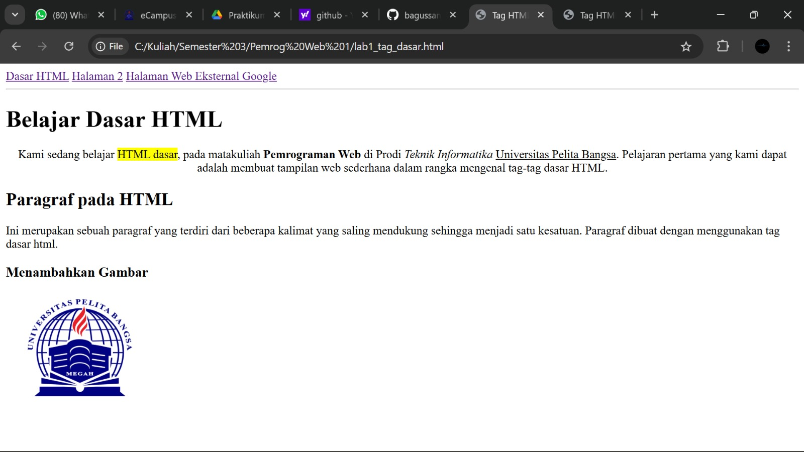
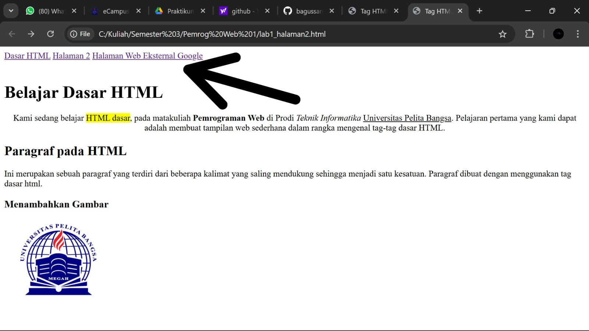
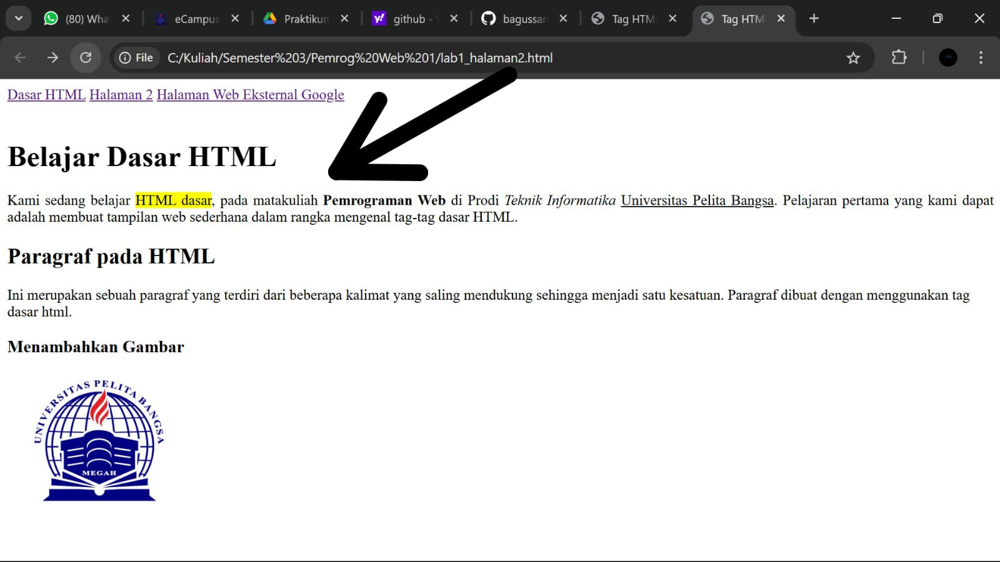
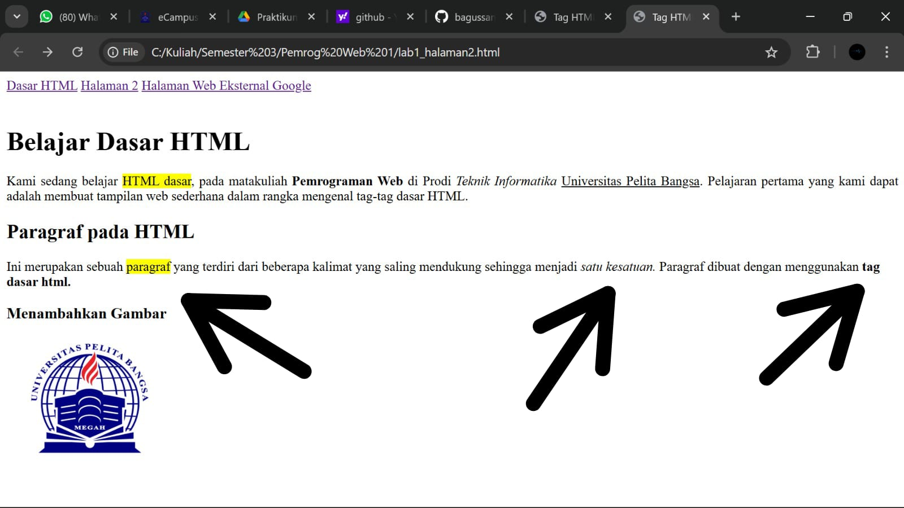

# Lab1Web

Nama : Bagus Sanjaya

Nim : 312410505

Kelas : TI.24.A.5

## Pertanyaan

1. Lakukan perubahan pada kode sesuai dengan keinginan anda, amati perubahannya adakah error ketika terjadi kesalahan penulisan tag?

## Jawaban

1. ini menggunakan tag `
`

dan ini menggunakan tag ` `

2. ini meggunakan `align="center"`

dan ini menggunakan `align="justify"`

3. Ini sebelum saya tambahkan tag `<mark>, <i>, dan <b>`
   

Ini sesudah saya tambahkan tag `<mark>, <i>, dan <b>`

Itu adalah beberapa perubahan yang saya lakukan dan ketika saya melakukan tidak terjadi error atau kesalahan.

## Pertanyaan

2. Apa perbedaan dari tag `
` dengan tag ` `, berikan penjelasannya!

## Jawaban

Kalau `
` itu untuk membuat sebuah paragraf yang otomatis ada sebuah jarak atas dan bawahnya, sedangkan ` ` dipakai untuk pindah ke baris selanjutnya dan tanpa jarak tambahan.

## Pertanyaan

3. Apa perbedaan atribut `title` dan `alt` pada tag ``, berikan penjelasannya!

## Jawaban

- Atribut `alt` digunakan untuk memberi teks alternatif jika gambar tidak bisa ditampilkan (misalnya ketika jaringan/koneksi ktia lemot atau bisa jadi juga gambarnya rusak) jadi kalau gambar tidak muncul, yang tampil tulisannya saja.

- Sedangkan Atribut `title` digunakan untuk memberi informasi tambahan saja, jadi semisal kita arahkan kursor ke gambar maka akan muncul judul/title tersebut.

## Pertanyaan

4. Untuk mengatur ukuran gambar, digunakan atribut width dan height. Agar tampilan gambar proporsional sebaiknya kedua atribut tersebut diisi semua atau tidak? Berikan penjelasannya!

## Jawaban

Jika ingin gambar menjadi proporsional, kita bisa mengisi salah satu atribut saja (width atau height) karena jika kita mengisi salah satu (misalnya width) maka browser otomatis menyesuaikan (height) sesuai ukurannya juga. Dan jika kita isi dua-duanya sekaligus, memungkinkan gambar menjadi gepeng atau ketarik kalau angkanya tidak sesuai rasio.

## Pertanyaan

5. Pada link tambahkan atribut target dengan nilai atribut bervariasi ( _blank, _self, _top, _parent ), apa yang terjadi pada masing-masing nilai antribut tersebut?

## Jawaban

- _blank = Saat klik linknya, halaman akan terbuka di tab/jendela baru dan halaman lama tetap terbuka, kemudian jadi punya dua tab.

- _self = Saat klik linknya, halaman akan terbuka tetapi tetap di tab/jendela yang sama.
 
- _parent = Karena halaman tidak beradaa di dalam frame/inframe, jadi hasilnya sama dengan _self.

- _top = Ini sama seperti _parent, jadi kalau halamannya bukan bagian dari frame/inframe, efeknya sama dengan _self. 
